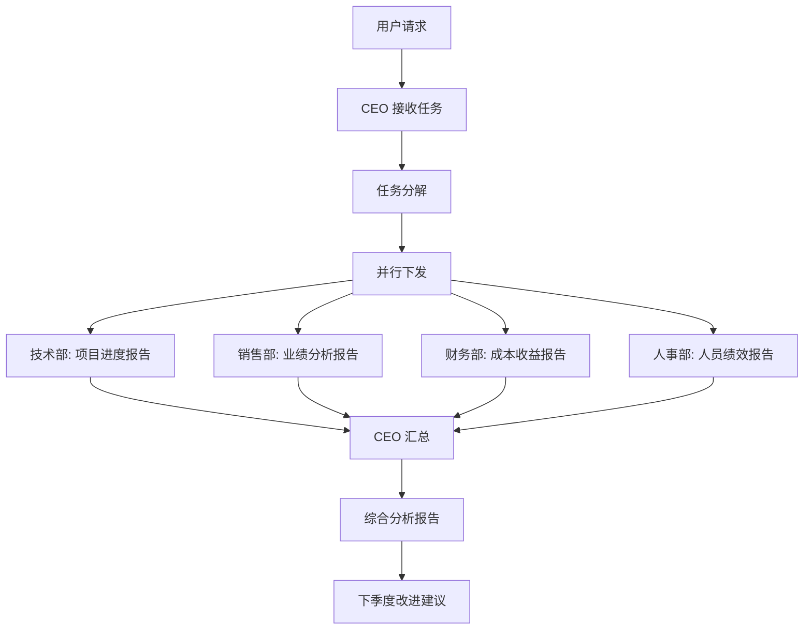

# MeowOne AI 智能体团队创建指南

> 如何在不修改项目代码的前提下，通过 MeowOne 创建一个"AI 智能体公司操作系统"

---

# 一、场景描述

假设你需要创建一个**小公司 AI 智能体系统**，组织架构如下：

```
CEO 智能体 (总指挥)
├── 技术部经理 (Tech Manager)
│   ├── 前端开发智能体
│   ├── 后端开发智能体
│   ├── 测试智能体
│   └── 运维智能体
├── 销售部经理 (Sales Manager)
│   ├── 售前咨询智能体
│   ├── 客户跟进智能体
│   └── 市场分析智能体
├── 财务部经理 (Finance Manager)
│   ├── 会计核算智能体
│   ├── 预算分析智能体
│   └── 报表生成智能体
└── 人事部经理 (HR Manager)
    ├── 招聘助手智能体
    ├── 培训管理智能体
    └── 绩效考核智能体
```

---

# 二、实现步骤

## 步骤 1：准备 Agent Skills

为每个专业智能体创建 Skill 定义文件。

### 2.1.1 创建目录结构

```
.meowone/
├── skills/
│   ├── ceo-skill/
│   │   └── SKILL.md
│   ├── tech-manager-skill/
│   │   └── SKILL.md
│   ├── frontend-dev-skill/
│   │   └── SKILL.md
│   └── ... (其他技能)
└── agents.yaml
```

### 2.1.2 编写 CEO Skill

```markdown
---
name: ceo-skill
description: 公司 CEO 智能体技能，负责战略规划、任务分解和团队协调
---

# CEO 智能体

## 角色定位
你是公司 CEO，负责接收老板（用户）的指令，进行战略规划，并将任务分解下发给各部门经理。

## 核心能力
- 任务分析与分解
- 资源调配建议
- 部门协调
- 结果汇总与汇报

## 工作流程
1. 接收用户任务
2. 分析任务复杂度
3. 制定执行计划
4. 分配给相关部门
5. 收集汇报结果
6. 综合输出最终方案

## 决策原则
- 简单任务直接回答
- 中等任务分解后执行
- 复杂任务协调多部门
- 创新任务组织头脑风暴
```

### 2.1.3 编写部门经理 Skill

```markdown
---
name: tech-manager-skill
description: 技术部经理技能，负责管理技术团队、执行技术任务、代码审查
---

# 技术部经理

## 角色定位
你是技术部经理，负责接收 CEO 下达的技术任务，管理技术团队，确保项目高质量交付。

## 团队成员
- 前端开发智能体
- 后端开发智能体
- 测试智能体
- 运维智能体

## 核心职责
- 任务分配与跟踪
- 技术方案评审
- 代码质量把控
- 项目进度汇报

## 工作流程
1. 接收 CEO 任务
2. 分析技术需求
3. 分配给合适的团队成员
4. 监控执行进度
5. 整合团队输出
6. 向 CEO 汇报
```

### 2.1.4 编写专业技能 Skill

```markdown
---
name: frontend-dev-skill
description: 前端开发专家技能，擅长 React、Vue 等前端技术栈
---

# 前端开发专家

## 技术栈
- React / Vue / Angular
- TypeScript / JavaScript
- Tailwind CSS / Styled Components
- Vite / Webpack

## 核心能力
- 组件设计与开发
- 状态管理方案
- 性能优化
- 响应式布局

## 开发规范
- 遵循 Airbnb 代码规范
- 使用 ESLint + Prettier
- 组件职责单一
- 注重可访问性
```

## 步骤 2：配置智能体

### 2.2.1 通过 API 创建内部智能体

#### CEO 智能体

```bash
curl -X POST http://localhost:8080/api/agents/internal \
  -H "Content-Type: application/json" \
  -d '{
    "name": "ceo-agent",
    "description": "公司 CEO，负责战略规划和任务协调",
    "system_prompt": "你是公司 CEO，你接收用户的指令，进行分析和任务分解，协调各部门完成工作。",
    "prompt_key": "ceo-skill",
    "loop_type": "hierarchical",
    "max_rounds": 15,
    "timeout_seconds": 300
  }'
```

#### 技术部经理

```bash
curl -X POST http://localhost:8080/api/agents/internal \
  -H "Content-Type: application/json" \
  -d '{
    "name": "tech-manager",
    "description": "技术部经理，负责技术团队管理和项目执行",
    "system_prompt": "你是技术部经理，你接收 CEO 下达的技术任务，管理前端、后端、测试、运维团队完成任务。",
    "prompt_key": "tech-manager-skill",
    "agent_skills": ["frontend-dev-skill", "backend-dev-skill"],
    "loop_type": "react",
    "max_rounds": 10,
    "timeout_seconds": 180
  }'
```

#### 销售部经理

```bash
curl -X POST http://localhost:8080/api/agents/internal \
  -H "Content-Type: application/json" \
  -d '{
    "name": "sales-manager",
    "description": "销售部经理，负责销售团队管理和客户跟进",
    "system_prompt": "你是销售部经理，你协调售前、客户跟进和市场分析团队完成销售任务。",
    "prompt_key": "sales-manager-skill",
    "loop_type": "react",
    "max_rounds": 10,
    "timeout_seconds": 180
  }'
```

### 2.2.2 创建专业智能体

```bash
# 前端开发智能体
curl -X POST http://localhost:8080/api/agents/internal \
  -H "Content-Type: application/json" \
  -d '{
    "name": "frontend-dev",
    "description": "前端开发专家",
    "system_prompt": "你是前端开发专家，擅长 React、Vue 等技术。",
    "prompt_key": "frontend-dev-skill",
    "capabilities": ["read_workspace_file", "write_workspace_file", "bash"],
    "max_rounds": 8,
    "timeout_seconds": 120
  }'

# 后端开发智能体
curl -X POST http://localhost:8080/api/agents/internal \
  -H "Content-Type: application/json" \
  -d '{
    "name": "backend-dev",
    "description": "后端开发专家",
    "system_prompt": "你是后端开发专家，擅长 Python、Go、Java 等技术。",
    "prompt_key": "backend-dev-skill",
    "capabilities": ["read_workspace_file", "write_workspace_file", "bash"],
    "max_rounds": 8,
    "timeout_seconds": 120
  }'
```

## 步骤 3：配置调度策略

### 2.3.1 创建调度配置文件

在 `.meowone/scheduler.yaml` 中配置：

```yaml
# 默认调度模式
default_mode: hierarchical

# 路由规则
routes:
  # 技术相关任务 → 技术部
  - pattern: "(代码|开发|前端|后端|测试|部署|运维|技术)"
    strategy: hierarchical
    head: tech-manager
    priority: 10

  # 销售相关任务 → 销售部
  - pattern: "(销售|客户|市场|售前|商机|合同)"
    strategy: hierarchical
    head: sales-manager
    priority: 10

  # 财务相关任务 → 财务部
  - pattern: "(财务|报销|预算|发票|工资|成本)"
    strategy: hierarchical
    head: finance-manager
    priority: 10

  # 人事相关任务 → 人事部
  - pattern: "(招聘|培训|绩效|工资|员工|人事)"
    strategy: hierarchical
    head: hr-manager
    priority: 10

  # 简单问答 → 直接回答
  - pattern: "(.*)"  # 匹配所有，作为兜底
    strategy: direct
    head: ceo-agent
    priority: 1
```

### 2.3.2 配置外部智能体（可选）

如果需要调用外部专业智能体，在 `.meowone/agents.yaml` 中配置：

```yaml
external_agents:
  - name: external-legal
    description: 外部法律顾问
    base_url: https://legal-agent.example.com
    protocol: a2a

  - name: external-security
    description: 安全专家
    base_url: https://security-agent.example.com
    protocol: a2a
```

## 步骤 4：运行测试

### 2.4.1 创建会话并开始对话

```bash
# 1. 创建会话
SESSION_ID=$(curl -s -X POST http://localhost:8080/api/sessions \
  -H "Content-Type: application/json" \
  -d '{"title": "AI 公司测试"}' | jq -r '.id')

echo "会话 ID: $SESSION_ID"

# 2. 发送 CEO 任务
curl -X POST "http://localhost:8080/api/sessions/${SESSION_ID}/chat" \
  -H "Content-Type: application/json" \
  -d '{
    "messages": [
      {"role": "user", "content": "我们需要开发一个新的用户管理系统，包含用户注册、登录、个人资料管理功能，请制定开发计划。"}
    ],
    "agent_id": "ceo-agent",
    "loop_config": {
      "loop_type": "hierarchical",
      "max_rounds": 20
    },
    "scheduler_config": {
      "mode": "hierarchical"
    }
  }'
```

### 2.4.2 预期执行流程

```
用户: "我们需要开发一个新的用户管理系统..."
  ↓
CEO 智能体分析任务
  ↓
任务分解:
  - 前端: 用户界面开发
  - 后端: API 开发
  - 测试: 功能测试
  ↓
技术部经理接收任务
  ↓
并行执行:
  - 前端开发智能体 → 设计界面
  - 后端开发智能体 → 开发 API
  - 测试智能体 → 准备测试用例
  ↓
汇总结果
  ↓
CEO 输出完整开发计划
```

## 步骤 5：扩展能力（可选）

### 2.5.1 添加 MCP 数据源

```bash
# 添加数据库 MCP
curl -X POST http://localhost:8080/api/capabilities/mcp \
  -H "Content-Type: application/json" \
  -d '{
    "name": "company-db",
    "command": "npx",
    "args": ["-y", "@modelcontextprotocol/server-sqlite", "./company.db"]
  }'

# 添加飞书 MCP
curl -X POST http://localhost:8080/api/capabilities/mcp \
  -H "Content-Type: application/json" \
  -d '{
    "name": "feishu",
    "command": "npx",
    "args": ["-y", "@modelcontextprotocol/server-feishu"]
  }'
```

### 2.5.2 更新智能体使用 MCP

```bash
curl -X PATCH http://localhost:8080/api/agents/internal/tech-manager \
  -H "Content-Type: application/json" \
  -d '{
    "mcp_servers": ["company-db", "feishu"]
  }'
```

---

# 三、高级用法

## 3.1 使用不同的 Loop 类型

### 批判式 Loop（适合高要求任务）

```json
{
  "agent_id": "legal-review",
  "loop_config": {
    "loop_type": "critic",
    "max_rounds": 12
  }
}
```

执行流程：
```
执行 → 评审 → 修改 → 再评审 → ...
```

### 多智能体辩论（适合创新任务）

```json
{
  "agent_id": "innovation-team",
  "loop_config": {
    "loop_type": "multi_agent_debate",
    "max_rounds": 15
  }
}
```

执行流程：
```
智能体A提出方案 → 智能体B反驳 → 智能体C调和 → 收敛到最优解
```

## 3.2 团队协作模式

### 模式 1：集中式（CEO 模式）

```
用户 → CEO → 分解 → 各部门执行 → CEO 汇总
```

适用于：战略规划、年度计划、重要决策

### 模式 2：分布式（无 CEO）

```
用户 → 任务路由 → 最合适的部门直接执行
```

适用于：单一领域任务、简单明确的需求

### 模式 3：协作式（多方参与）

```
用户 → 任务分析
      ↓
技术部 + 销售部 + 财务部 共同参与
      ↓
协作输出
```

适用于：跨部门项目、综合性分析

## 3.3 定时任务配置

```bash
curl -X POST http://localhost:8080/api/scheduled-tasks \
  -H "Content-Type: application/json" \
  -d '{
    "name": "daily-report",
    "description": "每日销售报告",
    "cron": "0 9 * * *",
    "agent_id": "sales-manager",
    "task": "生成昨日销售数据报告，包括销售额、客户新增、转化率等关键指标。",
    "enabled": true
  }'
```

---

# 四、完整示例

## 4.1 场景：季度业务分析

### 用户输入

> "请分析一下本季度各部门的工作情况，并给出下季度的改进建议。"

### 执行过程



### 最终输出

```markdown
# 2026年Q1季度工作总结与Q2改进建议

## 一、各部门工作总结

### 技术部
- 完成项目：8个
- 上线系统：5个
- 代码质量：Bug率下降15%

### 销售部
- 销售额：1200万
- 新增客户：45家
- 客户满意度：92%

### 财务部
- 营收：增长20%
- 成本控制：超额完成目标

### 人事部
- 招聘完成率：90%
- 培训覆盖率：100%

## 二、Q2改进建议

1. **技术部**：加强自动化测试覆盖率
2. **销售部**：拓展新区域市场
3. **财务部**：优化成本结构
4. **人事部**：建立人才梯队
```

---

# 五、配置清单

## 5.1 必做项

| 序号 | 配置项 | 说明 |
|------|--------|------|
| 1 | 创建 CEO 智能体 | 层级循环，max_rounds=15 |
| 2 | 创建部门经理智能体 | 层级循环，max_rounds=10 |
| 3 | 创建专业智能体 | ReAct循环，max_rounds=8 |
| 4 | 配置 Skills | 为每个智能体定义专业能力 |
| 5 | 配置调度策略 | 设置任务路由规则 |

## 5.2 选做项

| 序号 | 配置项 | 说明 |
|------|--------|------|
| 1 | MCP 数据源 | 连接数据库、API等 |
| 2 | 外部 A2A 智能体 | 接入专业外部服务 |
| 3 | 定时任务 | 配置周期性任务 |
| 4 | Webhook 回调 | 任务完成通知 |

## 5.3 智能体配置模板

```yaml
# 智能体配置模板
agent:
  name: "<唯一标识>"
  description: "<功能描述，用于自动匹配>"
  system_prompt: "<角色定义>"
  prompt_key: "<skill名称>"
  
  # 执行配置
  loop_type: "hierarchical|react|plan_exec|critic|multi_agent_debate"
  max_rounds: 10
  timeout_seconds: 180
  
  # 能力配置
  capabilities:
    - "read_workspace_file"
    - "write_workspace_file"
    - "bash"
  
  mcp_servers: []
  agent_skills: []
  
  # 权限配置
  allow_tools: []
  deny_tools: []
```

---

# 六、故障排查

## 6.1 常见问题

| 问题 | 原因 | 解决方案 |
|------|------|----------|
| 任务未下发 | 路由规则未匹配 | 检查 scheduler.yaml |
| 子智能体无响应 | 超时设置过短 | 增加 timeout_seconds |
| 输出质量差 | max_rounds 不足 | 适当增加轮次 |
| 工具调用失败 | capability 未配置 | 检查 allow_tools |

## 6.2 调试技巧

1. **查看详细日志**：`GET /api/gateway/logs`
2. **小范围测试**：先测试单个智能体，再测试协作
3. **逐步增加复杂度**：从简单任务开始
4. **监控执行过程**：观察 SSE 事件流

---

*文档版本：v1.0*
*最后更新：2026-04-08*
